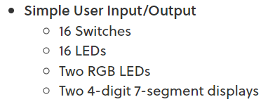
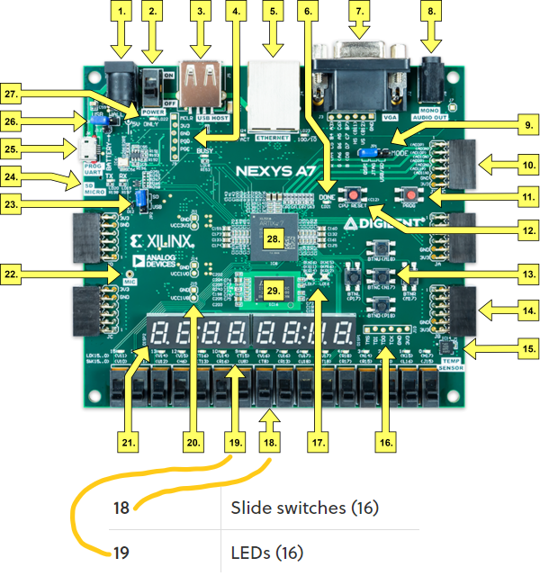
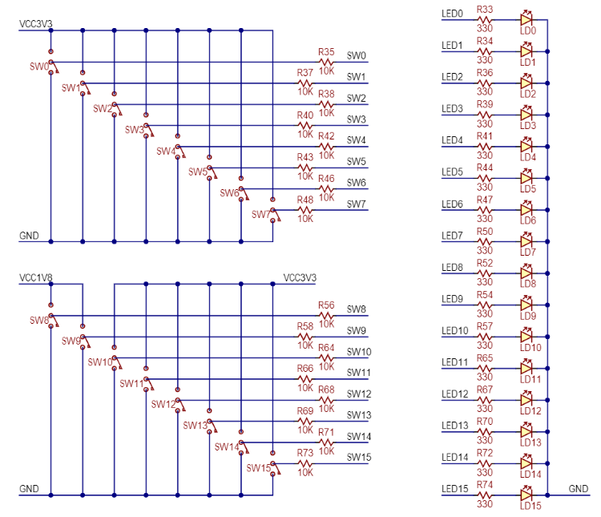

# Lab 2: MATĚJ ČERNOHOUS - příprava

   ## Základní uživatelské input/output:

   

   ## Nexus A7 deska:

   

   ## Vnitřní zapojení LEDek a Switchů:

   

   ## Připojení pinů:

   

   ## Tabulka pro shnutí PINů LED
   | **LED číslo** | **Název** |**Pin** |
   | :-: | :-: | :-: |
   | 0 | LD0 | H17 |
   | 1 | LD1 | K15 |
   | 2 | LD2 | J13 |
   | 3 | LD3 | N14 |
   | 4 | LD4 | R18 |
   | 5 | LD5 | V17 |
   | 6 | LD6 | U17 |
   | 7 | LD7 | U16 |
   | 8 | LD8 | V16 |
   | 9 | LD9 | T15 |
   | 10 | LD10 | U14 |
   | 11 | LD11 | T16 |
   | 12 | LD12 | V15 |
   | 13 | LD13 | V14 |
   | 14 | LD14 | V12 |
   | 15 | LD15 | V11 |
   
   ## Tabulka pro shnutí PINů Switch
   | **Switch číslo** | **Název** |**Pin** |
   | :-: | :-: | :-: |
   | 0 | SW0 | J15 |
   | 1 | SW1 | L16 |
   | 2 | SW2 | M13 |
   | 3 | SW3 | R15 |
   | 4 | SW4 | R17 |
   | 5 | SW5 | T18 |
   | 6 | SW6 | U18 |
   | 7 | SW7 | R13 |
   | 8 | SW8 | T8 |
   | 9 | SW9 | U8 |
   | 10 | SW10 | R16 |
   | 11 | SW11 | T13 |
   | 12 | SW12 | H6 |
   | 13 | SW13 | U12 |
   | 14 | SW14 | U11 |
   | 15 | SW15 | V10 |
