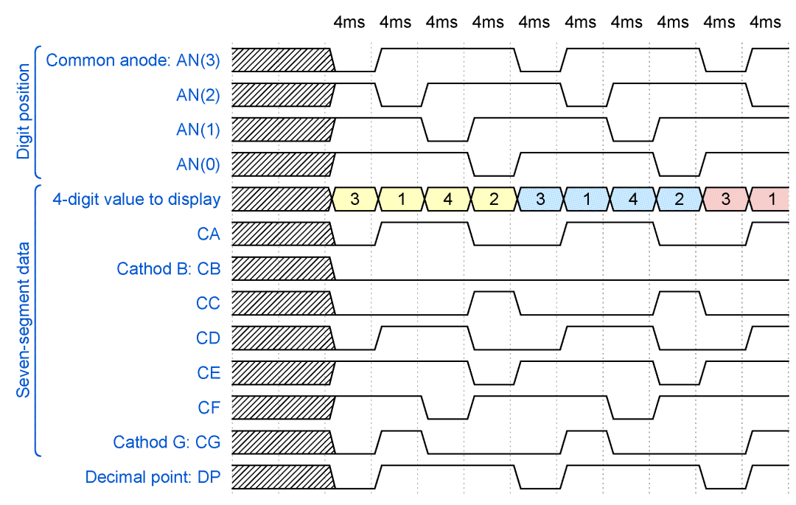

## Preparation tasks (done before the lab at home)

A common way to control multiple displays is to gradually switch between them. We control (connect to supply voltage) only one of the displays at a time.

Due to the physiological properties of human vision, it is necessary that the time required to display the whole value is a maximum of 16&nbsp;ms. If we display four digits, then the duration of one of them is 4&nbsp;ms. If we display eight digits, the time is reduced to 2&nbsp;ms, etc.

1.

  Z minulých cvičení již víme že zapojení Anody pro ovládání Sedmisegmentovky je ACTIVE LOW (spínání PNP tranzistoru), jestnotlivé segmenty sedmisegmentovek jsou také   zapojeny jako ACTIVE LOW (ovládáme katody diod).
  Pomocí těchto znalostí a online nástroje WaveDrom dokážeme nasimulovat chtěný průběh:

  

  > The figure above was created in [WaveDrom](https://wavedrom.com/) digital timing diagram online tool. The figure source code is as follows:
  >
  ```javascript
  {
  signal:
  [
    ['Digit position',
      {name: 'Common anode: AN(3)', wave: 'xx01..01..01'},
      {name: 'AN(2)', wave: 'xx101..01..0'},
      {name: 'AN(1)', wave: 'xx1.01..01..'},
      {name: 'AN(0)', wave: 'xx1..01..01.'},
    ],
    ['Seven-segment data',
      {name: '4-digit value to display', wave: 'xx3333555599', data: ['3','1','4','2','3','1','4','2','3','1']},
      {name: 'CA', wave: 'xx01.0.1.0.1'},
      {name: 'Cathod B: CB', wave: 'xx0.........'},
      {name: 'CC', wave: 'xx0..10..10.'},
      {name: 'CD', wave: 'xx01.0.1.0.1'},
      {name: 'CE', wave: 'xx1..01..01.'},
      {name: 'CF', wave: 'xx1.01..01..'},
      {name: 'Cathod G: CG', wave: 'xx010..10..1'},
    ],
    {name: 'Decimal point: DP', wave: 'xx01..01..01'},
  ],
  head:
  {
    text: '                    4ms   4ms   4ms   4ms   4ms   4ms   4ms   4ms   4ms   4ms',
  },
}
  ```
