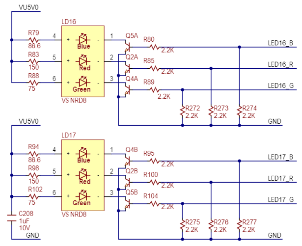
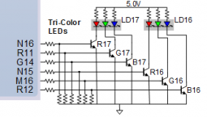
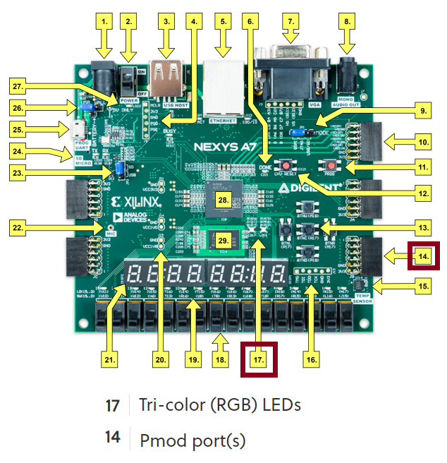
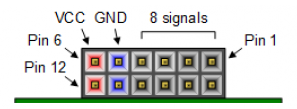
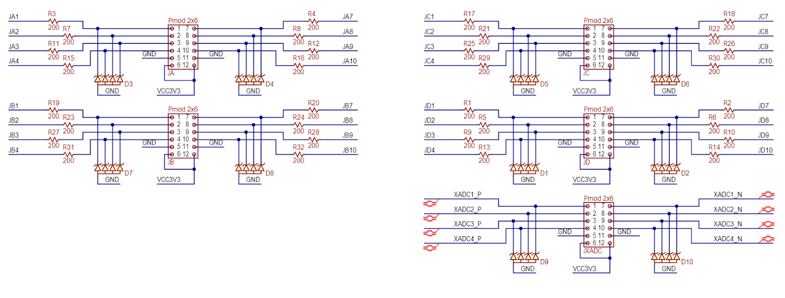
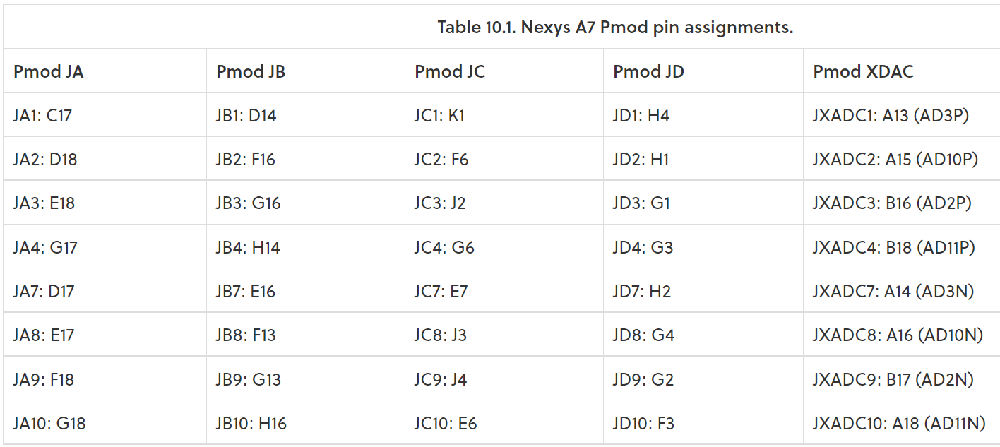

## Preparation tasks (done before the lab at home)

1. See [schematic](https://github.com/tomas-fryza/digital-electronics-1/blob/master/docs/nexys-a7-sch.pdf) or [reference manual](https://reference.digilentinc.com/reference/programmable-logic/nexys-a7/reference-manual) of the Nexys A7 board and find out the connection of two RGB LEDs, ie to which FPGA pins are connected and how. How you can control them to get red, yellow, or green colors? Draw the schematic with RGB LEDs.

Ze schématu lze vidět že jednotlivé barevné složky (Red Green nebo Blue dioda) RGB diody přivedením HIGH úrovně na ovládací pin sepneme NPN tranzistor.
Tím docílíme rozsvícení určité barevné diody RGB diody. 

"Note: Digilent strongly recommends the use of pulse-width modulation (PWM) when driving the tri-color LEDs. Driving any of the inputs to a steady logic ‘1’ will result in the LED being illuminated at an uncomfortably bright level."

| **RGB LED** | **Artix-7 pin names** | **Red** | **Yellow** | **Green** |
| :-: | :-: | :-: | :-: | :-: |
| LD16 | N15, M16, R12 | `1,0,0` | `1,1,0` | `0,1,0` |
| LD17 | N16, R11, G14 | `1,0,0` | `1,1,0` | `0,1,0` |

Z tabulky můžeme pozorovat, že pro ovládání semaforu nebudeme potřebovat modrou diodu RGB diody -> může být připojena na LOW úroveň nehledě na vyžadovanou barvu.

2. See [schematic](https://github.com/tomas-fryza/digital-electronics-1/blob/master/docs/nexys-a7-sch.pdf) or [reference manual](https://reference.digilentinc.com/reference/programmable-logic/nexys-a7/reference-manual) of the Nexys A7 board and find out to which FPGA pins Pmod ports JA, JB, JC, and JD are connected.

Pmod - Peripheral Module Interface

"Pmod™ devices are Digilent's line of small I/O interface boards that offer an ideal way to extend the capabilities of programmable logic and embedded control boards. They allow sensitive signal conditioning circuits and high-power drive circuits to be placed where they are most effective - near sensors and actuators."

