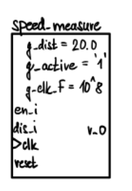
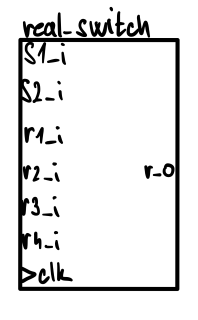
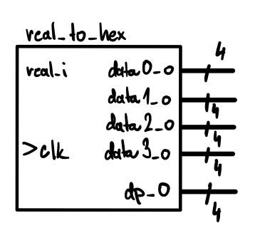
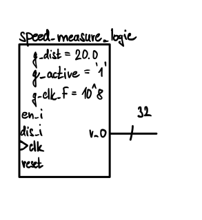
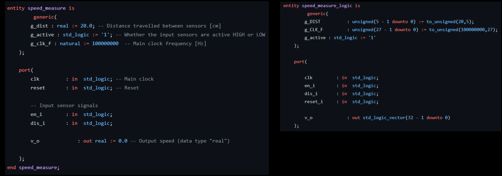
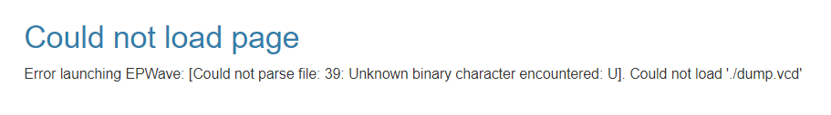
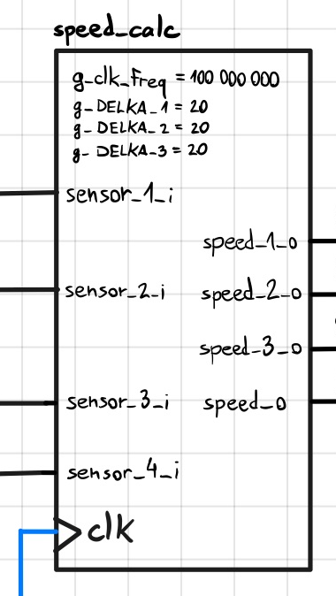
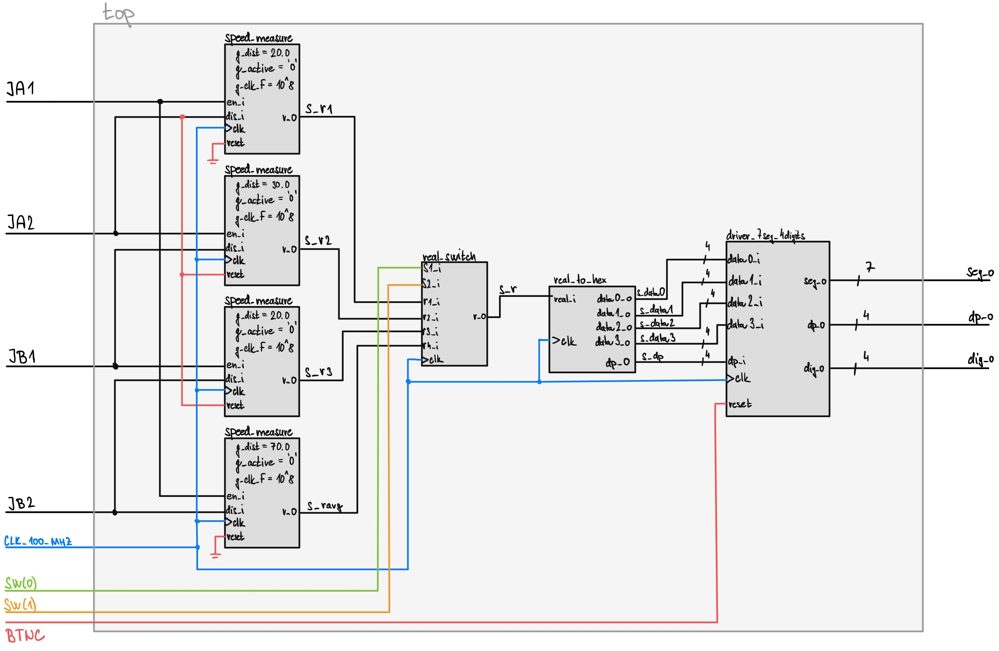

# Measuring the speed of an object through a series of IR sensors (such as HW-201) or optical barriers

### Team members

* Petr Klíma - Team leader, Programming, Design
   * Top simulation
   * Odkazy na kody misto bloku kodu
* Vladimír Skoumal - Testing, Hardware behaviour, Video presentation
   * Video presentation, 
   * Modules testing a description (real_switch and real_to_hex) 	
* Matěj Černohous - Programming, Documentation
   * Check english language
   * Comment TOP source code
* Together - finish TOP description

### Table of contents

* [Project objectives](#objectives)
* [Hardware description](#hardware)
* [VHDL modules description and simulations](#modules)
* [unused VHDL modules](#unused_modules)
* [TOP module description and simulations](#top)
* [Video](#video)
* [References](#references)

## Project objectives

Official assigment: "Measuring the speed of an object through a series of IR sensors (such as HW-201) or optical barriers."

After consulting with the project assignee it was specified that the object is to pass by at least 4 IR sensors (connected to 
the NEXYS A7-50T board) and it's speeds (speed in each "sector" between individual sensors) are to be calculated and displayed on NEXYS's 7segment displays.

Our objective is to fulfill the assigment, make the funcionality versitale and modular, write the code in compliance with VHDL Guidelines and document the process 
and the final product in this file and video presentation.

## Hardware description

### Nexys A7-50T Board
It is an accessible FPGA developement board with great performance: We were already familiar with it's funcionality from the Digital electronics (DE1) practicals. 
For more information see [The store page](https://store.digilentinc.com/nexys-a7-fpga-trainer-board-recommended-for-ece-curriculum/), 
[reference manual](https://reference.digilentinc.com/reference/programmable-logic/nexys-a7/reference-manual) or 
[schematic](docs/nexys-a7-sch.pdf).

### IR sensor HW-201
It's main function is to transmit and recieve reflected infrared waves (wavelength 7000-1000 nm) to signalize the passing of an object. It is important to note 
that the IR light will have trouble reflecting of off black object, as it will be absorbed. Another important thing to mention is the fact that the sensor functions 
as "Active LOW" - meaning that when no reflected light is recieved the data output is HIGH and when reflected light is recieved it's LOW. For more information see 
[The datasheet](docs/ir_datasheet.pdf) or our [simplified description](HW201.md).

## VHDL modules description and simulations

### Speed_measure

#### Description
As the name of module suggests this module measures speed of any object using 2 inputs for [IR sensors](#sensors), which are connected to `en_i` and `dis_i` inpusts. Module has **3 generic variables**: 

  1. `g_dist` = distance between sensors in cm, we work with it in [TOP](#top)
  2. `g_active` = it represents active state of sensors (we use g_active = 1 for simulations)
  3. `g_clk_f` = clock frequency

[speed_measure.vhd](modules/speed_measure.vhd)

#### Simulation
Distance between sensors is set to 0,0025 cm and time between detections is 2080 ns (0,00208 ms), so we should get speed (0,000025/0,00000208) = approx. 12,019 m/s. 
- [Simulation in EDAplayground](https://www.edaplayground.com/x/SycU)
- You can see that we got a speed ~ 12,02 m/s 

### Real_switch

Real switch module is similar to a Multiplexor. There are four inputs - `r1_i`, `r2_i`, `r3_i`, `r4_i`, 2 controlling inputs `s1_i`, `s2_i` and one output - `r_o`. Which of the four inputs is outputted is determined by the combination of the controlling inputs.

 

[real_switch.vhd](modules/real_switch.vhd)

| **Controlling inputs (s2_i s1_i)** | **Output** |
| :-: | :-: |
| 0 0 | `r4_i` |
| 0 1 | `r3_i` |
| 1 0 | `r2_i` |
| 1 1 | `r1_i` |

The table shows the relation of controlling inputs and output.

### Real_to_hex

This modules!s function is to convert a data type real number into a hexadecimal number (including the decimal point). The module's input `real_i` is converted (through function floor() from the `ieee.math_real` library). 
It is important to note that the conversion code is nowhere neal ideal and conventional, since working with the data type real variables is somewhat tricky. It would be favorable to use custom functions for the calculations. 
The range of outputted hexadecimal number was decided to be "XX.XX" - which meant we would be able to display speeds between 0.01 - 99.99 m/s. The output `dp_o` represents the decimal point's position and outputs 
`data0_o`, `data1_o`, `data2_o`, `data3_o` represent the individual decimals.

[real_to_hex.vhd](modules/real_to_hex.vhd)

#### Algorithm

Despite the code looking complicated at first, it is a fairly simple chain of if-elsif conditional statements, each of them being responsible for one of the four orders of magnitude (tens, units, tenths, hundredths of m/s). 
Depending on the rounded value the output of that spicific order is set to the appropriate (hexa)decimal constant.

#### Simulation

In the simulation we can see that data type real number is converted to 4 decimal numbers and decimal point's information.

- [EDAplayground link](https://www.edaplayground.com/x/uEgg)

## unused VHDL modules

### Speed_measure_logic

#### Description
This module was supposed to replace the module speed_measure after figuring out that program using data type real cannot be synthetized (therefore cannot be uploaded onto the board). As can be seen on the images bellow, the only real differences were different data types and different calculation of final speed.

[speed_measure_logic.vhd](modules/speed_measure_logic.vhd)

**Changes in generic variables**: 

  1. `g_dist` = now as an unsigned with 5 bits (up to 31 cm - more than length of our connector cables)
  2. `g_clk_f` = now as an unsigned with 27 bits (up to ~ 134*10^6 - more than the board main clock's frequency)

**Changes in output**:

  `v_o` = now a 32 bit logic vector (why 32 bits -> see local variable `s_help`)
  
**Changes in local variables**:
   
   1. `s_v` = 32 bit unsigned number used for speed calculation, later converted to logic vector as the module's output
   2. `s_help` = replacement of `c_cmT_to_ms` - 32 bits needed because multiplying two binary numbers of M & N bits requires M+N bits (27+5 = 32)

**Changes in speed calculation**:
  
  Speed is now calculated by taking advantage of the fact that when a number is shifted by X bits, it is equivalent to deviding that number by 2^X. We do of course 
  lose some precision, but since the displayed speed is in range of 00.00 ÷ 99.99 m/s the units of cm/s are sufficient.

**Change comparison**:
  Comparison of parts of the speed_measure module (on the left) and speed_measure_logic module (on the right) 

#### Simulation
The simulation shows activating signals in order 1234 and that reverse (4321), the speed is calculated as a data type real number.

- [EDAplayground link](https://www.edaplayground.com/x/jZ7T)

### Speed_calc

#### Description
This module was created as an alternative to the 4 `speed_meas` modules. It's advantage is that is is able to measure and calculate  the speed of passing object in BOTH directions. But the combination of `speed_meas` modules is much more simpler, modular and effective. Regardless, we thought it would be good to mention how measuring speed from both directions in a single block of code could be implemented.

[speed_calc.vhd](modules/speed_calc.vhd)

#### Changes
As can be seen in the [code](modules/speed_calc.vhd) the measuring is done by switching between different states which represent in which sector an from what direction the object is moving.

#### Simulation

- [EDAplayground link](https://www.edaplayground.com/x/SMVi)

## TOP module description and simulations

[top.vhd](modules/top.vhd)

### Description
By having 4 sensors connected to PMod pins JA1, JA2, JB1, JB2 we have 3 "sections" of speed measurement + average speed across all sectors. That's why **we use 4 _speed_measure_ modules**. Outputs from these modules go into **_real_switch_** module. Which of the 4 speeds is shown on the 7-segment display is determined by the combination of switches (principle of multiplexor). But before that the output signal from **_real_switch_** is inputted to the module **_real_to_hex_**, which tranforms the data type real signal to hexadecimal format (including the decimal point). The output signal of said module is then inputted to the module **_driver_7seg_4digits_**, which makes it possible for the data to be displayed on the 7segment display.

| **Switches combination** | **Displayed speed** |
| :-: | :-: |
| 00 | Average speed |
| 01 | Speed of section 1 |
| 10 | Speed of section 2 |
| 11 | Speed of section 3 |
   

### Simulation

## Video

Write your text here

## References

1. Write your text here.
